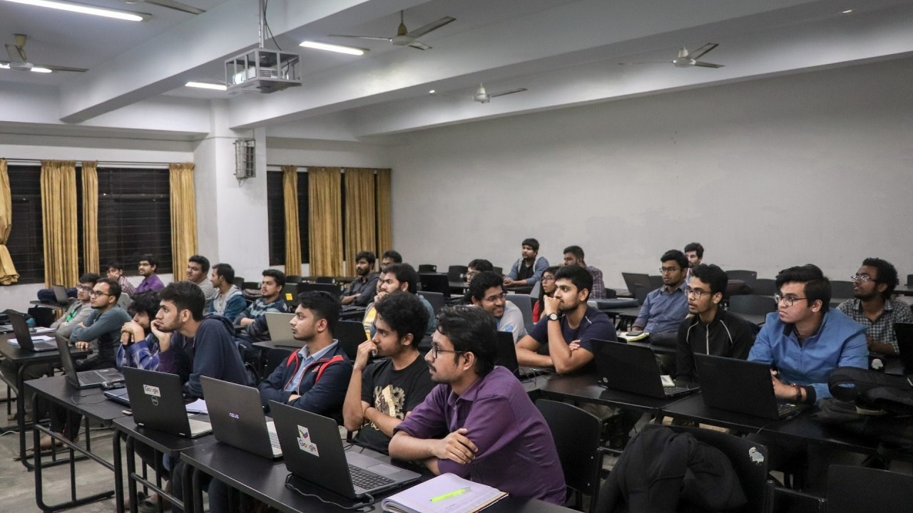
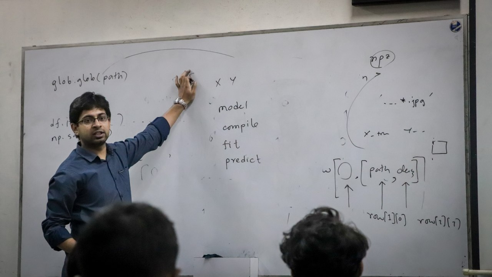
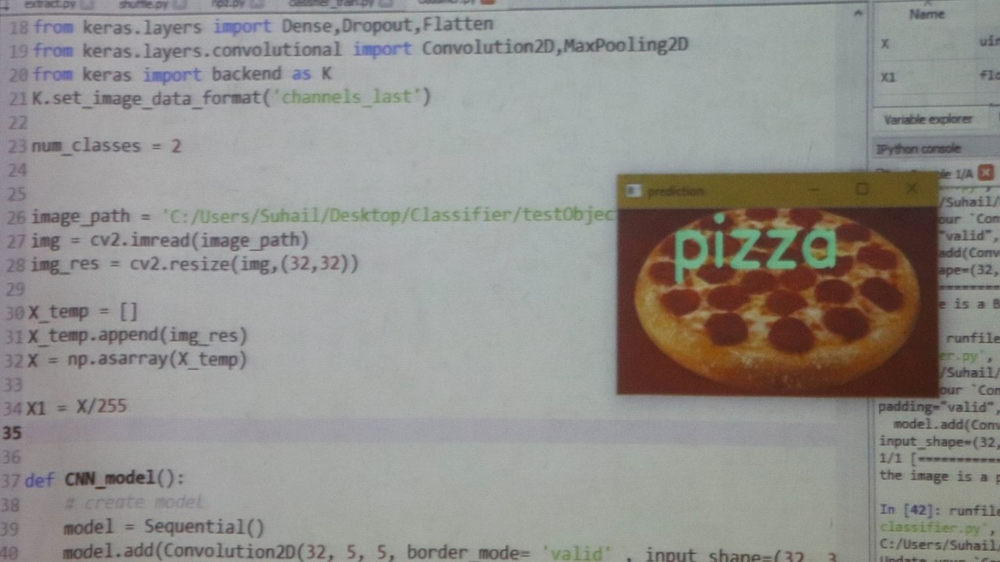
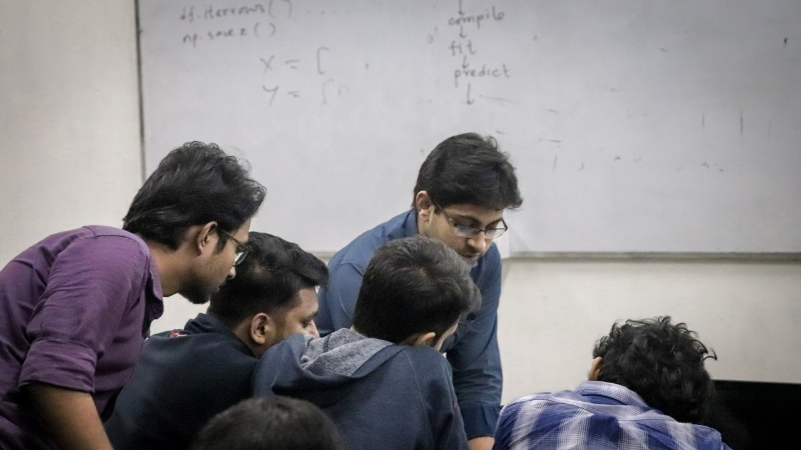

+++
title = "Course on Python & Data Science"
date = 2017-11-15T17:00:00  # Schedule page publish date.
draft = false

# Talk start and end times.
#   End time can optionally be hidden by prefixing the line with `#`.
#time_start = 2018-08-20T11:10:00
time_start = 2019-08-27
#time_end = 2030-06-01T15:00:00

# Abstract and optional shortened version.
abstract = "A Workshop on Basic Python & Data Science"
abstract_short = ""

# Name of event and optional event URL.
event = "Seminar on Road to SP Cup and VIP Cup."
event_url = ""

# Location of event.
location = "Bangladesh University of Engineering and Technology, Dhaka, Bangladesh"

# Is this a selected talk? (true/false)
selected = true

# Projects (optional).
#   Associate this talk with one or more of your projects.
#   Simply enter your project's filename without extension.
#   E.g. `projects = ["deep-learning"]` references `content/project/deep-learning.md`.
#   Otherwise, set `projects = []`.
#projects = ["deep-learning"]

# Tags (optional).
#   Set `tags = []` for no tags, or use the form `tags = ["A Tag", "Another Tag"]` for one or more tags.
tags = []

# Links (optional).
url_pdf = ""
url_slides = ""
url_video = ""
url_code = ""

# Does the content use math formatting?
math = false

# Does the content use source code highlighting?
highlight = true

# Featured image
# Place your image in the `static/img/` folder and reference its filename below, e.g. `image = "example.jpg"`.
[header]
image = "featured.jpg"
caption = ""

+++

## Participants:

## Class in progress:

## The Pizza Classifier!

## Hands-on Q & A Session:

